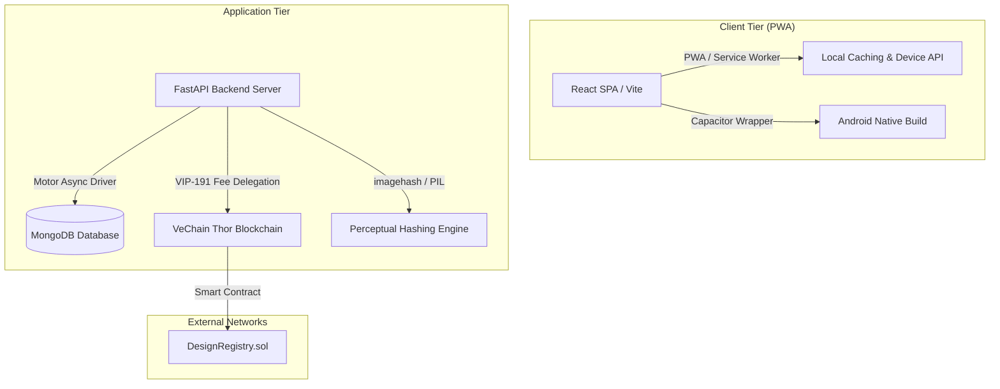

# 🛡️ CraftShield: Secure Decentralized Jewellery Marketplace & Provenance Platform

CraftShield is a next-generation, secure, role-based jewellery marketplace and custom-order management Progressive Web App (PWA) built for the modern digital era. It combines traditional bespoke artisan crafting workflows with cutting-edge **VeChain Thor Blockchain Design Provenance**, Visual Intellectual Property (IP) Protection, role-based dashboards, and regional localization.

---

## 🏛️ System Architecture

CraftShield utilizes a modern three-tier decoupled architecture designed for high performance, non-blocking asynchronous operations, and cryptographically verified data integrity:



- **Frontend**: Single Page Application (SPA) built with **React** and **Vite**, styled with a custom high-fidelity responsive system (optimized with glassmorphism, transitions, and micro-interactions). It is equipped with localized language bundles and a fully compliant Service Worker for PWA capability.
- **Backend**: **FastAPI** (Python 3.9+) providing production-grade REST APIs, utilizing an asynchronous event handler paradigm and securing routes via stateless **JWT (JSON Web Tokens)**.
- **Database**: **MongoDB** accessed through the **Motor** asynchronous driver for non-blocking I/O database transactions.
- **Blockchain Core**: Fee-delegated integration on the **VeChain Thor Testnet** to register and verify unique jewellery design proofs without requiring end-users to manage wallets, pay gas fees, or understand cryptocurrency mechanics.

---

## ✨ Core Features & Capabilities

### 1. Unified Authentication & Role-Based Access Control (RBAC)
Stateless JWT security divides the application into three user portals:
*   **Client**: Active immediately upon registration. Clients can browse the catalog, submit custom design requests, manage quotations, lock and fund Protected Orders, audit transaction logs, track production phases, and verify blockchain provenance records.
*   **Artisan**: Created in a `pending` status. Artisans must be approved by the Administrator to access the platform. Verified artisans can manage their business profile, list products, accept custom design requests, issue binding quotations, process production updates, and register design provenance on-chain.
*   **Administrator**: Automatically seeded on application launch (`admin` / `1234`). Admins manage artisan verifications, oversee global order analytics, audit payments, inspect dispute queues, and resolve conflict flags.

### 2. The Custom Order Lifecycle Workflow
The entire transactional and assembly pipeline operates under a strict state-machine system to secure funds and designs:
*   **Protected Orders**: All transactions utilize the custom **Safe Payment Vault** (abstracted from the technical term "Escrow") to hold funds securely until contract conditions are satisfied.
*   **Advance Payment Lock**: Artisans are locked from starting design work or physical production until the client funds the advance deposit to the Safe Vault.
*   **Final Delivery Lock**: The final shipment/handover is locked until the client deposits the remaining balance.
*   **24-Hour Cancellation with Refund**: Clients can cancel an order within 24 hours of creation. If the advance payment has already been secured, the backend automatically issues a **50% refund** to the client's Protected Ledger, recording it as an audited `refund` transaction.

### 3. VeChain Thor Blockchain Design Provenance
To mitigate design piracy and protect artisan IP:
*   **Design Cryptographic Bundles**: Combines design image bytes, catalog metadata (Title, Description, Artisan ID), and timestamps into a secure JSON bundle, computing a unique SHA-256 hash.
*   **On-Chain Registry**: Anchors the design hash on the VeChain Thor Testnet via the custom `DesignRegistry` Solidity contract.
*   **VIP-191 Fee Delegation**: The platform signs and sponsors gas fees for transactions. Artisans verify and anchor designs seamlessly with a single click.
*   **Perceptual Hashing & Similarity Scanning**: Uses a perceptual hashing algorithm (`phash`) to compute visual similarity. If an artisan uploads a design that shares >85% resemblance (Hamming distance < 10) with an existing catalog item, the system flags a duplicate alert and prompts the user.
*   **Override & Dispute Signals**: Artisans can override a similarity flag to register their work, which automatically registers a dispute flag (`design_hash_conflict`) in the Admin Panel for auditing.

### 4. Rich Media & Visual Asset Management
*   **Multi-Image Carousels**: Supports multiple image listings for products. Cards include touch-friendly next/prev selectors and dynamic counter indicators.
*   **Drag-and-Drop Uploader**: Modern file uploader with thumbnail previews, instant deletion (✕), and primary image selection toggles.

### 5. PWA, Mobile, & Offline Accessibility
*   **Offline Fallbacks**: Integrates service-worker caching (`sw.js`) and a standard Web Manifest (`manifest.json`) for seamless mobile home-screen installation.
*   **Direct Telephony Integration**: To support regions with poor internet connectivity, artisan profile cards include one-click **"Call Now"** (`tel:`) and prefilled **"Send SMS"** hooks.
*   **Regional Localization**: Full dynamic localization system supporting:
    *   English (en)
    *   Tamil (ta)
    *   Telugu (te)
    *   Kannada (kn)
    *   Malayalam (ml)

---

## 📂 Repository Module Layout

The workspace is organized into modular directories representing each system tier:

```
├── backend/                        # FastAPI application codebase
│   ├── app/
│   │   ├── routes/                 # API controllers grouped by context
│   │   │   ├── auth.py             # Login, Client/Artisan Registration, Session
│   │   │   ├── client.py           # Client marketplace, requests, payments
│   │   │   ├── artisan.py          # Artisan catalog, quotations, blockchain registries
│   │   │   └── admin.py            # Verification dashboard, catalog audits, disputes
│   │   ├── schemas/                # Pydantic v2 validation models
│   │   ├── services/               # Core business services
│   │   │   ├── blockchain.py       # VeChain RPC interaction, VIP-191 & hashing
│   │   │   ├── image_similarity.py # Perceptual hashing (pHash) comparison logic
│   │   │   └── order_service.py    # Escrow and state transition logic
│   │   ├── utils/                  # Cryptographic and serialization utilities
│   │   ├── config.py               # Application settings and env bindings
│   │   └── database.py             # MongoDB connection pool & starter seeds
│   ├── requirements.txt            # Python dependencies configuration
│   └── .env.example                # Sample environment configuration file
│
├── FrontEnd/                       # React client application codebase
│   ├── src/
│   │   ├── context/
│   │   │   └── CraftShieldContext.jsx # Central state provider & API caller
│   │   ├── components/             # Reusable visual units (Layout, Modals, etc.)
│   │   ├── pages/                  # Role-based workspace dashboards
│   │   │   ├── Login.jsx           # High-fidelity authorization page
│   │   │   ├── ClientDashboard.jsx # Marketplace, order tracker, safe ledger
│   │   │   ├── ArtisanDashboard.jsx# Store manager, custom orders, earnings, IP registry
│   │   │   └── AdminPanel.jsx      # Artisan approvals, disputes tracker, system logs
│   │   ├── utils/
│   │   │   └── translations.js     # Translation dictionaries for localization
│   │   ├── App.jsx                 # Routing core & UI controller
│   │   ├── main.jsx                # Application React entry point
│   │   └── index.css               # Design system token definitions
│   ├── public/                     # Static PWA assets (sw.js, manifest.json)
│   ├── android/                    # Capacitor Android Studio wrapper project
│   ├── package.json                # Frontend dependencies configuration
│   └── capacitor.config.json       # Native build target configuration
│
├── contracts/                      # Smart Contract project workspace
│   ├── DesignRegistry.sol          # Solidity provenance register contract
│   ├── hardhat.config.js           # Hardhat development setup
│   ├── deploy.js                   # Hardhat deployment script
│   └── deploy_onchain.py           # Python alternative on-chain deployment runner
│
├── run_app.bat                     # Windows launch runner (starts backend + frontend)
├── render.yaml                     # Render platform Blueprint deployment spec
└── render_deployment_guide.md      # Detailed cloud deployment documentation
```

---

## ⚙️ Quick Start (Local Development)

The system includes a batch runner to launch the development environment on Windows machines immediately.

### Prerequisites
1.  **Python 3.9+** installed on your system path.
2.  **Node.js (v16+)** and npm installed.
3.  **MongoDB** running locally on port `27017` (`mongodb://localhost:27017`).

### Startup Instructions
1.  Double-click the **`run_app.bat`** file in the root of the workspace.
2.  The batch runner launches two concurrent terminal windows:
    *   **Backend Server**: Starts FastAPI on `http://127.0.0.1:8000`. API docs are interactive at `http://127.0.0.1:8000/docs`.
    *   **Frontend Dev Server**: Starts Vite on `http://localhost:5173`.
3.  Navigate your browser to `http://localhost:5173`.

---

## 🔐 Default Seed Credentials

To support rapid verification and demonstration, the database seeds default testing credentials on startup if collections are empty:

| Username | Password | Role | Account State |
| :--- | :--- | :--- | :--- |
| `admin` | `1234` | **Admin** | Active |
| `aurelia_gold` | `password123` | **Artisan** | Verified (Products Preloaded) |
| `tanaka_metals` | `password123` | **Artisan** | Verified (Products Preloaded) |

*You can register new clients immediately via the Auth Page. Registered artisans will start as `pending` and must be verified by logging into the `admin` account first.*

---

## 🔄 Lifecycle Workflow Sequence

The diagram below maps the precise step-by-step transaction and design execution lifecycle for custom orders:

```mermaid
sequenceDiagram
    autonumber
    actor Client as Client
    actor Artisan as Artisan
    actor Blockchain as VeChain Thor
    actor Admin as System Admin

    Admin->>Artisan: Verifies Artisan Status (Admin Panel)
    Artisan->>Artisan: Visual Uploader & similarity scan (pHash)
    alt Design similarity conflicts (>85%)
        Artisan->>Admin: Overrides & registers design (Triggers "design_hash_conflict")
    else Design is unique
        Artisan->>Blockchain: Anchor cryptographic design hash (DesignRegistry.sol)
    end
    Client->>Artisan: Submits Custom Request (Specs, files, deadline)
    Artisan->>Client: Accepts Custom Request & Sends Quotation (Deposit, Total Price)
    Client->>Artisan: Accepts Quotation (Order state: "Advance Payment Pending")
    
    rect rgb(20, 20, 30)
        Note over Client, Artisan: Safe Payment Vault Operations
        alt Client cancels within 24-hour window
            Client->>Artisan: Cancels Order (State: "Cancelled", 50% refund issued from vault)
        else Client pays deposit
            Client->>Artisan: Deposits Advance Payment (State: "Advance Payment Secured")
            Note over Artisan: Artisan begins drafting & physical crafting
            Artisan->>Client: Updates statuses: Design -> In Production -> Quality Check
            Client->>Artisan: Deposits Final Balance (State: "Final Payment Secured")
            Artisan->>Client: Handover & Ship (State: "Delivered")
            Client->>Artisan: Confirms Handover (State: "Completed", Funds released to Artisan)
        end
    end
```



---

## ☁️ Deployment Guide (Render Blueprint)

We provide a `render.yaml` blueprint configuration in the root directory to deploy the complete application automatically to Render.

### Step 1: Initialize MongoDB Atlas (Free Tier)
1.  Register at [MongoDB Atlas](https://www.mongodb.com/cloud/atlas).
2.  Deploy an **M0 Shared Free Tier** Cluster.
3.  Add IP `0.0.0.0/0` under **Network Access** to allow inbound traffic from Render's cloud servers.
4.  Create database credentials (e.g., user: `craftshield_db_user`, password: `your_password`).
5.  Generate the python driver connection string:
    `mongodb+srv://craftshield_db_user:<password>@cluster.mongodb.net/?retryWrites=true&w=majority`

### Step 2: Run Render Blueprint
1.  Push this workspace into a private or public repository on GitHub.
2.  Log in to [Render](https://dashboard.render.com) and click **Blueprints** -> **New Blueprint Instance**.
3.  Select your repository.
4.  Render parses `render.yaml` and presents configuration variables. Provide your MongoDB Atlas Connection URI for the **`MONGODB_URL`** field.
5.  Click **Deploy**. Render will configure the FastAPI Python Web Service and compile the React-Vite Static Site.

### Step 3: Configure React Router Rewrites (Manual Adjustments)
If deploying manually without the blueprint, configure the static site rewrite rules to prevent `404` errors when refreshing subpages (e.g., `/dashboard`):
*   **Source**: `/*`
*   **Destination**: `/index.html`
*   **Action**: `Rewrite`

---

## 🛠️ Diagnostics & Utilities

The workspace includes standalone CLI scripts to verify system subsystems:

*   **`print_db_products.py`**: Queries your local MongoDB instance, listing all preloaded and newly created products, their categories, prices, registered blockchain transactions, and perceptual hash metadata.
*   **`test_live_hash.py`**: Test script simulating image hashing, bundle construction, VeChain transaction fee-delegated execution, and querying the smart contract for on-chain proof retrieval. Use this to verify connection to the testnet blockchain before launching the application.
