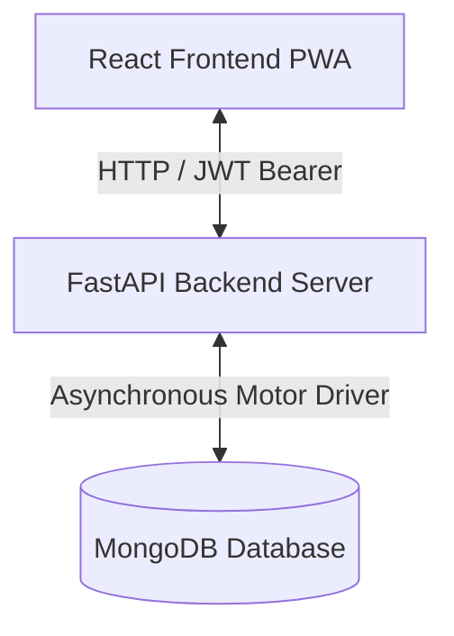
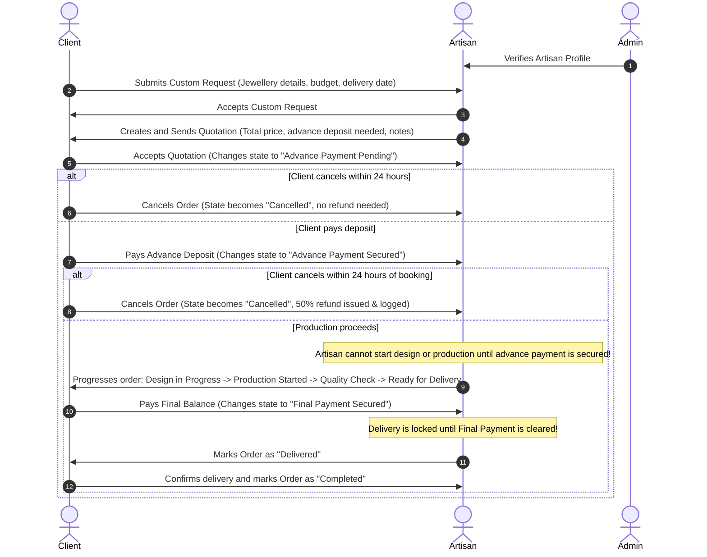

# CraftShield: Integrated System Documentation

CraftShield is a secure, role-based jewellery marketplace and custom-order management Progressive Web App (PWA) built with modern design principles. This document provides a comprehensive summary of the architecture, features, database models, and workflows implemented across both the **FastAPI (Backend)** and **React-Vite (Frontend)**.

---

## 🏛️ System Architecture Overview

CraftShield uses a modern three-tier architecture designed for responsiveness, high performance, and robust security:



* **Frontend**: React SPA powered by Vite, utilizing HMR, Lucide Icons, Framer Motion, and Tailwind-compatible styling systems.
* **Backend**: FastAPI web framework (Python 3.9+) implementing asynchronous route handlers and strict role-based route protection dependencies.
* **Database**: MongoDB (NoSQL) with the motor asynchronous driver, ensuring non-blocking I/O database operations.

---

## 🔑 Authentication & Role-Based Access Control (RBAC)

Secured by stateless JWT (JSON Web Tokens) with a unified login portal that assigns users to one of three roles:

| Role | Verification Rule | Core Privileges |
| :--- | :--- | :--- |
| **Client** | Active immediately upon registration. | Search products, submit custom design requests, accept/reject quotes, pay mock payments, cancel bookings within 24 hours (with 50% refund), and track order stages. |
| **Artisan** | Created as `pending`. Must be approved by Admin. | Manage business profile, publish products (only if verified with multiple images), accept custom requests, send design quotations, and update production states. |
| **Admin** | Automatically seeded (`admin` / `1234`). | Verification dashboard for artisans, view all users, global transaction metrics, manage disputes, and oversee orders. |

---

## ⚙️ Backend Implementation Details

### 📂 File Structure and Endpoints
All API endpoints are prefixed with `/api` and grouped into separate modular routers inside `backend/app/routes/`:

```
backend/app/
├── main.py (App initialization, CORS configuration, Lifespan database/seeding context)
├── config.py (Pydantic Settings for environment variables)
├── database.py (MongoDB client setup, index creation, default artisan/admin seeding)
├── dependencies.py (Auth checks: require_client, require_artisan, require_verified_artisan, require_admin)
└── routes/
    ├── auth.py (Registration & token issue endpoints)
    ├── client.py (Client dashboard & order pipeline endpoints)
    ├── artisan.py (Artisan profile, product CRUD & order management endpoints)
    └── admin.py (Verification & global system analytics endpoints)
```

### 🛠️ Core API Endpoints

#### **1. Authentication Router (`/api/auth`)**
* `POST /register/client`: Client account creation.
* `POST /register/artisan`: Artisan registration (marked `pending` verification).
* `POST /login`: Receives credentials, verifies password hashes using `bcrypt` and `passlib`, issues JWT Access Token.
* `GET /me`: Returns details of the logged-in user.

#### **2. Client Portal Router (`/api/client`)**
* `GET /dashboard`: Aggregates client-specific statistics (total requests, active orders, money spent) and retrieves the 5 most recent orders.
* `GET /artisans`: Fetches all verified artisans' profile details.
* `GET /products`: Returns active store products from verified artisans.
* `POST /custom-requests`: Client uploads a custom request.
* `DELETE /custom-requests/{id}`: Withdraws a request (only valid if `pending`).
* `GET /quotations`: Lists all design quotations received from artisans.
* `PUT /quotations/{id}/accept`: Accepts a quotation, triggering the creation of a formal Order.
* `PUT /quotations/{id}/reject`: Rejects a quotation.
* `POST /orders/{id}/payments/advance`: Processes the advance payment deposit to start production.
* `POST /orders/{id}/payments/final`: Processes the final payment to clear the order for delivery.
* `PUT /orders/{id}/complete`: Client marks order as completed.
* `PUT /orders/{id}/cancel`: Client cancels order within 24 hours of booking, refunding 50% of the advance deposit if paid.

#### **3. Artisan Portal Router (`/api/artisan`)**
* `GET /dashboard`: Artisan stats (total earned, product counts, request counts, active orders).
* `GET /profile` & `PUT /profile`: Business profile management.
* `GET /products` & `POST /products` & `PUT /products/{id}` & `DELETE /products/{id}`: CRUD operations on the artisan's public storefront (restricted to **verified** artisans, supporting multiple image URLs).
* `GET /custom-requests` & `PUT /custom-requests/{id}/accept` & `PUT /custom-requests/{id}/reject`: View and handle incoming custom requests.
* `POST /quotations`: Sends a design & cost quotation for an accepted custom request.
* `GET /orders` & `PUT /orders/{id}/status`: Tracks production states and updates statuses.
* `GET /payments`: View received payments history.

#### **4. Admin Portal Router (`/api/admin`)**
* `GET /dashboard`: Aggregates system-wide analytical metrics.
* `GET /users`: Lists all registered users in the system.
* `GET /artisans/pending`: Displays all artisans waiting for verification.
* `PUT /artisans/{id}/verify`: Sets verification status to `verified` or `rejected`.
* `GET /products` | `GET /orders` | `GET /payments` | `GET /disputes`: System-wide audit logs.

#### **5. Upload Utility Endpoint (`/api/upload`)**
* `POST /api/upload`: Receives multiple image files, saves them under `uploads/` using unique UUID names, and returns their paths. Serves images statically from the backend via `/uploads`.

---

## 🎨 Frontend Implementation & Localization Details

The frontend is a single-page React application containing responsive dashboards tailored dynamically based on the authenticated user's role.

### 🌐 Multi-Language Support (Localization)
- Supported languages: **English (en)**, **தமிழ் (Tamil - ta)**, **తెలుగు (Telugu - te)**, **ಕನ್ನಡ (Kannada - kn)**, and **മലയാളം (Malayalam - ml)**.
- Localized dynamic dictionary keys defined in [translations.js](file:///c:/Users/assas/OneDrive/Desktop/ALL%20COLLEGE%20WORK/clg%20wrk%20CodeZap%20hackton/FINALS/FrontEnd/src/utils/translations.js).
- Dynamically translates dynamic seeded catalog items (e.g. "Bespoke Rose Gold Filigree Ring", "Pendant", "18k Rose Gold, Diamond", and material/description details) alongside core UI titles.
- Saves active language preference in `localStorage`.

### 📂 Key Frontend Files
```
FrontEnd/src/
├── main.jsx (Application entry point)
├── App.jsx (Routing switcher, loading states, and toast notifications)
├── index.css (Central design tokens, glassmorphism UI helpers, layouts)
├── context/
│   └── CraftShieldContext.jsx (Central State Management & API Fetching Engine)
├── components/
│   ├── Layout.jsx (Navigation bar, user profile indicators, language switcher)
│   └── Modal.jsx (Custom popup wrappers for payments, quotations, and requests)
└── pages/
    ├── Login.jsx (Combined sleek Login / Register view with tab transitions)
    ├── ClientDashboard.jsx (Client portal: Marketplace, My Requests, Active Orders, Safe Vault Ledger)
    ├── ArtisanDashboard.jsx (Artisan portal: Requests, My Shop, Orders, Profile, Earnings)
    └── AdminPanel.jsx (Admin panel: Verifications, User List, System Logs, Disputes)
```

### 🧠 State Management: `CraftShieldContext`
The frontend maintains reactive synchronization with the backend via the `CraftShieldContext` provider:
- **Token & Session Persistence**: LocalStorage maintains the user session.
- **Smart Data Refreshing**: Dashboard stats, orders, and listings are refetched automatically in the background using `useCallback` triggers whenever a crucial operation finishes (e.g. accepting a quote, making a payment, or updating a product).
- **API Error Formatting**: Catches and translates structured FastAPI validation errors into human-readable notifications.

---

## 💎 Custom Enhanced Features

### 1. Multi-Image Carousel
Artisans can list products with multiple image URLs. The client and artisan product cards display interactive photo carousels featuring:
- Prev/Next triggers (`‹` and `›`).
- Dynamic slide count indicator tags (`1 / 3`).
- Clean handling for single-image products.

### 2. Offline / Low-Connection Direct Access
To support customers in regions with limited internet connection:
- Verified artisan cards render the artisan's contact phone number.
- Offers a **"Call Now"** button launching direct calls (`tel:` scheme).
- Offers a **"Send SMS"** button initiating a localized native pre-filled message introducing the client's design interest.

### 3. User-Friendly Nomenclature (Renaming "Escrow")
- The word "Escrow" has been fully abstracted to make the UI simple and accessible.
- Escrow orders are named **"Protected Orders"**.
- Escrow transactions and balances are represented as **"Safe Payment Vault"** or **"Protected Ledger"**.

### 4. 24-Hour Cancellation with 50% Refund Window
- Clients can cancel any active booking within 24 hours of creation.
- If the advance payment is already secured, the backend automatically refunds 50% of the advance amount to the client.
- Automatically inserts a transaction record of type `refund` and status `repaid` in the transaction history.
- Correctly lists the refund in the Safe Payment Ledger tab on the client dashboard.

---

## 🔄 The Custom Order Lifecycle Workflow

Here is the exact step-by-step lifecycle of custom design requests:



---

## 🔗 Blockchain Design Provenance (VeChain Testnet)

To prevent intellectual property theft and unauthorized design replication, CraftShield integrates an immutable, timestamped registration ledger on the **VeChain (VeChainThor) Testnet**.

### 🛠️ Key Cryptographic Services & Endpoints
1. **Design Hashing & Bundles (`backend/app/services/blockchain.py`)**:
   - Computes image **Perceptual Hash (pHash)** using `imagehash.phash` to identify visually similar or duplicate catalog photos.
   - Packages design files, metadata (Title, Description, Artisan ID, and registration timestamp) into an immutable JSON bundle.
   - Computes a secure SHA-256 hash of this bundle representing the design's unique cryptographic identity.
2. **On-Chain Anchor Transaction (`backend/app/services/blockchain.py`)**:
   - Executes smart contract transactions deploying the design hash onto the VeChain testnet blockchain using delegated transaction fee billing.
   - Returns transaction metadata: Transaction ID (TxID), Block number, registration timestamp, and artisan wallet addresses.
3. **Similarity Audit Check (`POST /api/artisan/products/{product_id}/check-design-similarity`)**:
   - Scans the database comparing image pHash distance. Alerts the artisan if a design shares higher than 85% resemblance (Hamming distance < 10) with existing products.
4. **Anchoring & Override (`POST /api/artisan/products/{product_id}/register-design`)**:
   - Allows artisans to proceed with design anchoring. If an override is requested, the system registers the design on-chain but files an automated dispute signal (`design_hash_conflict`) for admin review.
5. **Auditable Proof retrieval (`GET /api/artisan/products/{product_id}/design-proof`)**:
   - Fetches and displays proof metadata including explorer links pointing to the live VeChain Testnet blockchain ledger.

### 💻 User Interface Integration & Experience
- **Artisan Catalog Workspace**: Artisans get an **"Anchor Design Proof"** button triggering an automatic similarity check. If warning matches appear, they are prompted via an override modal dialog. Once registered, a **"Blockchain Verified"** badge links to the live transaction receipt.
- **Client Marketplace Page**: Renders the **"Blockchain Verified"** badge on matching product showroom cards, allowing buyers to inspect the immutable registration metadata and verify the artisan's authenticity.
- **Admin Audit Panel**: Catalog audits tab lists all active system products displaying their Blockchain status, showing details and transaction logs for every verified provenance record.

---

## 🚀 Running the Whole System Locally

### ⚡ Quick Start (Windows Batch Script)
You can run the entire system (both backend and frontend) concurrently in separate terminal windows by running:
```bash
./run_app.bat
```

### Backend Setup
1. **Pre-requisites**: Ensure MongoDB is running on port `27017` (`mongodb://localhost:27017`).
2. **Environment File**: Make sure `backend/.env` contains valid database keys.
3. **Execution**:
   ```bash
   cd backend
   venv\Scripts\activate
   uvicorn app.main:app --reload
   ```

### Frontend Setup
1. **Execution**:
   ```bash
   cd FrontEnd
   npm run dev
   ```
2. **Access**: Navigate to [http://localhost:5173](http://localhost:5173) in your web browser.
